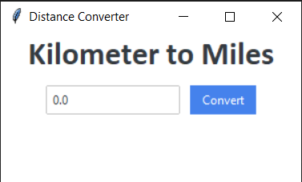
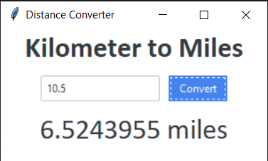

# Distance Converter

A simple Python GUI application to convert kilometers to miles.

## Description

This application provides a user-friendly interface for converting distances from kilometers to miles. It's built using Python and the ttkbootstrap library for an enhanced GUI experience.

## Screenshots

Here are two screenshots showcasing the Distance Converter application:

1. Initial State:

   

   This shows the application when it's first launched.

2. After Conversion:

   

   This demonstrates the application after a conversion has been performed.

## Features

- Convert kilometers to miles
- Clean and modern user interface
- Real-time conversion

## Requirements

- Python 3.x
- ttkbootstrap

## Installation

1. Clone this repository:
   ```
   git clone https://github.com/yourusername/Distance-Converter.git
   ```
2. Install the required packages:
   ```
   pip install ttkbootstrap
   ```

## Usage

Run the script:
```
python Distance_Converter.py
```

Enter a value in kilometers and click "Convert" to see the equivalent distance in miles.

## Contributing

Pull requests are welcome. For major changes, please open an issue first to discuss what you would like to change.

## License

[MIT](https://choosealicense.com/licenses/mit/)
